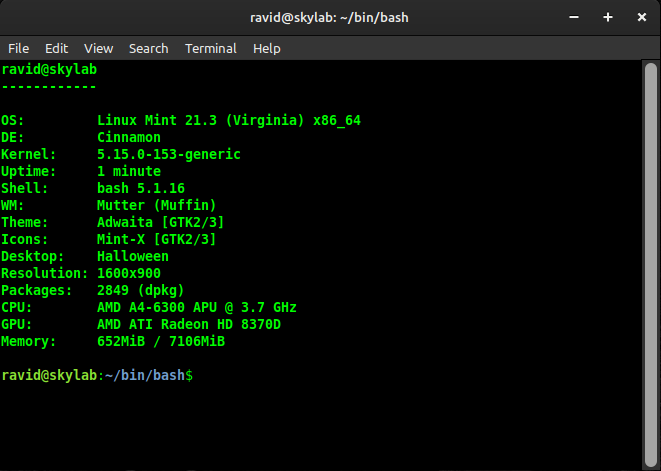

## Gretch - System Information Gathering Script

**Shell script written in bash for Linux Mint.**  
**Displays system information in your terminal.**    

 

**Instructions:**

1. Clone the repository.
2. Open your terminal and change directory into the newly created 'gretch' folder. `cd gretch`
3. Once there, you can run script using: `./gretch.sh`  
Note: you may need to change permission by typing: `chmod +x gretch.sh`    

 

**Or, Download the ZIP**    
1. This will go to your Downloads folder (as gretch-main).  
2. Extract files if necessary.  
3. Open terminal and navigate to Downloads `cd Downloads`, then to gretch-main `cd gretch-main`.  
4. From there, type: `chmod +x gretch.sh`     
5. Run script using `./gretch.sh`  

Of course, you can save the files to a location of your choice (e.g. bin/bash)

 
 

**Optional***  
This can be made to run everytime you open your terminal  
by placing the path (or alias) to script at the end of the .bashrc file.  

Example alias (place in .bashrc):  

`alias gret="~/bin/bash/gretch.sh"`  

Then just place alias at bottom of .bashrc  

`gret`  

To undo: comment out alias  
`#gret`  

   

